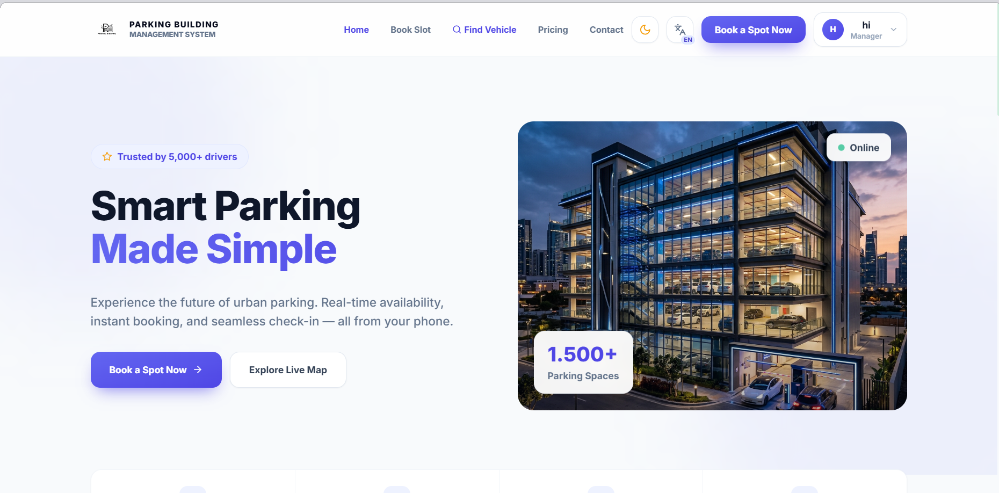
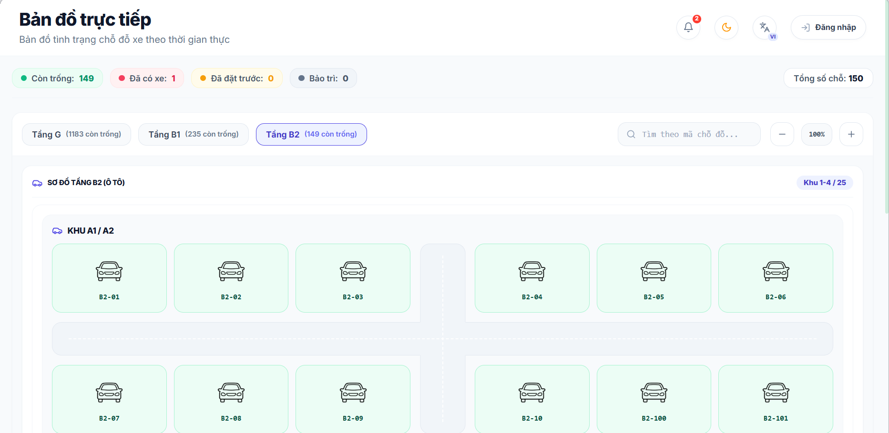
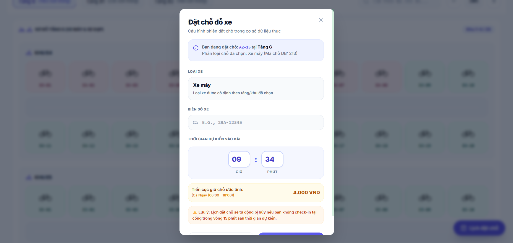
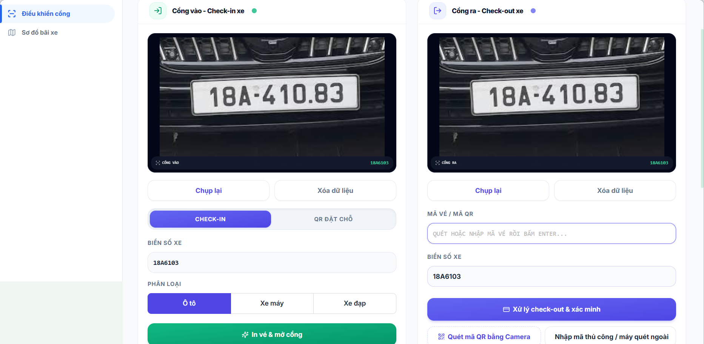
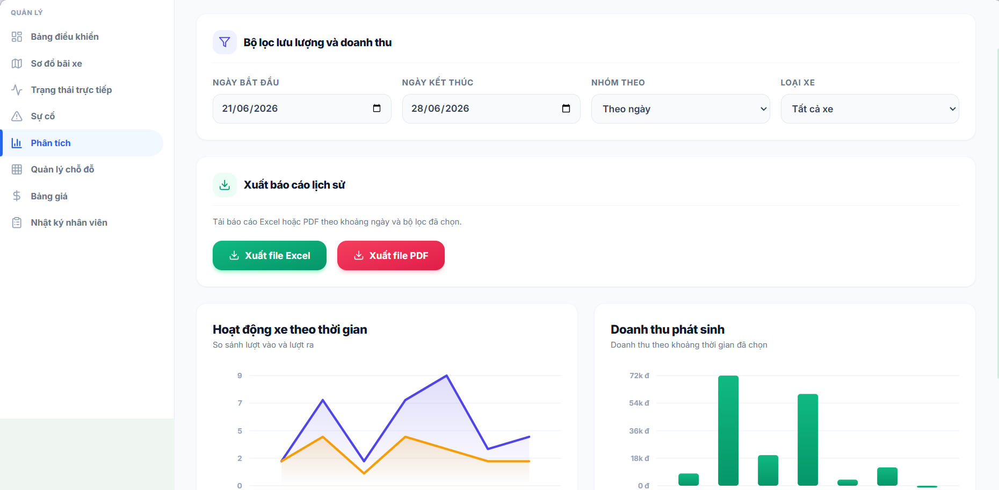

# SpotFlow | Smart Parking Building Management System

A React/Vite frontend for smart parking building operations, booking, gate control, payment, and management analytics.


## Overview

SpotFlow is the frontend application for a smart parking building management system. It helps users view parking availability, reserve slots, manage bookings, and complete check-in/check-out workflows.

The application also supports staff, managers, and administrators with gate operations, parking status monitoring, reports, pricing management, account management, and parking session tracking.

## Live Demo

- Vercel: https://parkingbuilding.vercel.app

> The demo uses backend API rewrites configured in `vercel.json`.

## Key Features

### Public / Guest

- Landing homepage
- Public parking map view
- Pricing and about pages

### Driver

- Slot booking
- My bookings
- QR ticket view
- Booking cancellation
- VNPay payment
- Parking map interaction

### Staff

- Gate check-in and check-out
- QR scanner
- Webcam and camera upload
- License plate recognition
- Cash payment verification
- Ticket and receipt printing

### Manager

- Dashboard summary
- Live parking status
- Incident management
- Analytics and report export
- Pricing management
- Staff logs
- Gate control access

### Admin

- Account management
- Create accounts
- Staff management
- Parking session search and detail view

### General

- Light/dark mode
- Vietnamese/English internationalization
- Toast notification system
- Role-based UI and routing

## Tech Stack

| Category | Technology |
|---|---|
| Framework | React 18, Vite 5 |
| Styling | Tailwind CSS, Ant Design, custom CSS |
| Routing | react-router-dom |
| HTTP Client | Axios |
| i18n | i18next, react-i18next |
| Icons | lucide-react, @ant-design/icons |
| Auth | JWT/Bearer token, Google OAuth |
| Camera/QR | react-webcam, html5-qrcode |
| Deployment | Vercel |

## Project Structure

```text
src/
  assets/
  components/
  context/
  features/
    parking-map/
    checkin-checkout/
    dashboard/
  locales/
  pages/
  services/
```

- `src/assets` stores logos, hero images, and vehicle images.
- `src/components` contains shared layout and UI infrastructure such as header, sidebar, footer, protected routes, logo, and toast provider.
- `src/context` contains authentication and theme providers.
- `src/features/parking-map` contains the interactive parking map, floor/slot views, booking actions, and slot detail handling.
- `src/features/checkin-checkout` contains gate control, QR scanning, camera capture/upload, and ticket/receipt modals.
- `src/features/dashboard` contains manager dashboard pages, live status, incidents, analytics, pricing, and staff logs.
- `src/locales` contains English and Vietnamese translation files.
- `src/pages` contains route-level pages such as login, register, home, settings, bookings, accounts, and payment success.
- `src/services` contains Axios API integration modules.

## Routes & Access

| Route | Access | Purpose |
|---|---|---|
| `/` | Public | Homepage |
| `/home` | Public | Homepage alias |
| `/login` | Public | User login and Google login |
| `/register` | Public | User registration flow |
| `/parking-map` | Public view, role-based actions | View parking map, book slots, or operate selected slot actions |
| `/my-bookings` | Driver / Registered_Driver / Member / Customer | View bookings, QR ticket, cancellation, and payment actions |
| `/checkin-checkout` | Staff, Manager | Gate check-in/check-out operations |
| `/dashboard` | Authenticated roles | Dashboard entry with role-aware behavior |
| `/analytics` | Manager | Traffic and revenue analytics with report export |
| `/slot-management` | Manager | Parking slot management view |
| `/accounts` | Admin | User account management |
| `/create-account` | Admin | Create new user accounts |
| `/admin/parking-sessions` | Admin | Search and review parking sessions |
| `/settings` | Authenticated roles | Account settings |
| `/payment-success` | Public | VNPay callback and payment result handling |

## Roles & Permissions

### Guest / Public

- View the homepage and public pages.
- Access the public parking map.
- Navigate to login or registration.

### Driver / Registered_Driver / Member / Customer

- Book available parking slots.
- View and manage personal bookings.
- View QR tickets.
- Cancel eligible reservations and pay through VNPay.

### Staff

- Operate gate check-in and check-out flows.
- Scan QR codes and upload/capture vehicle images.
- Use license plate recognition during gate operations.
- Verify cash payment and print tickets/receipts.

### Manager

- View dashboard summary and live parking status.
- Manage incidents and review operational alerts.
- Access analytics, report export, pricing management, and staff logs.
- Access gate control when needed.

### Admin

- Manage user accounts, roles, and account status.
- Create new accounts.
- Review staff information.
- Search and inspect parking session history.

## API Integration

- The Axios instance uses `/api` as the base URL.
- Vercel rewrites `/api/:path*` to the backend API.
- Bearer tokens are attached through an Axios request interceptor.
- `401` responses remove the token and redirect the user to the login page.

Service files:

- `src/services/api.js`
- `src/services/authService.js`
- `src/services/parkingService.js`
- `src/services/managerService.js`
- `src/services/adminService.js`
- `src/services/parkingSessionService.js`

## Environment / Proxy Notes

- The current frontend uses `/api` proxy/rewrite configuration.
- The backend target is configured in `vercel.json`.
- No client-side `.env.example` is currently provided.
- No real tokens, API keys, or secrets are stored in this README.

## Getting Started

### Prerequisites

- Node.js
- npm

### Installation

```bash
npm install
```

### Development

```bash
npm run dev
```

### Production Build

```bash
npm run build
```

### Preview Build

```bash
npm run preview
```

### Lint

```bash
npm run lint
```

## Available Scripts

| Script | Description |
|---|---|
| `npm run dev` | Starts the Vite development server. |
| `npm run build` | Builds the application for production. |
| `npm run preview` | Serves the production build locally for preview. |
| `npm run lint` | Runs ESLint for JavaScript and JSX files. |

## Deployment

The project is configured for Vercel deployment.

`vercel.json` contains:

- API rewrite from `/api/:path*` to the backend API.
- SPA fallback rewrite to `index.html`.

## Screenshots

> Screenshots are stored under `src/assets/readme-images/`.

### Homepage


### Parking Map


### Booking Modal


### Gate Control


### Manager Analytics


## Known Notes

- The notification bell currently has a UI indicator, but a persistent notification service was not confirmed in the frontend services.
- The registration flow should be reviewed because `Register.jsx` may call a verification method name that differs from the current `authService`.

## Contributors

- GiangJuly
- Le Ha Hoang Minh
- Tran Hien Vinh

## License

This project is currently developed for academic purposes. A license file has not been added yet.
